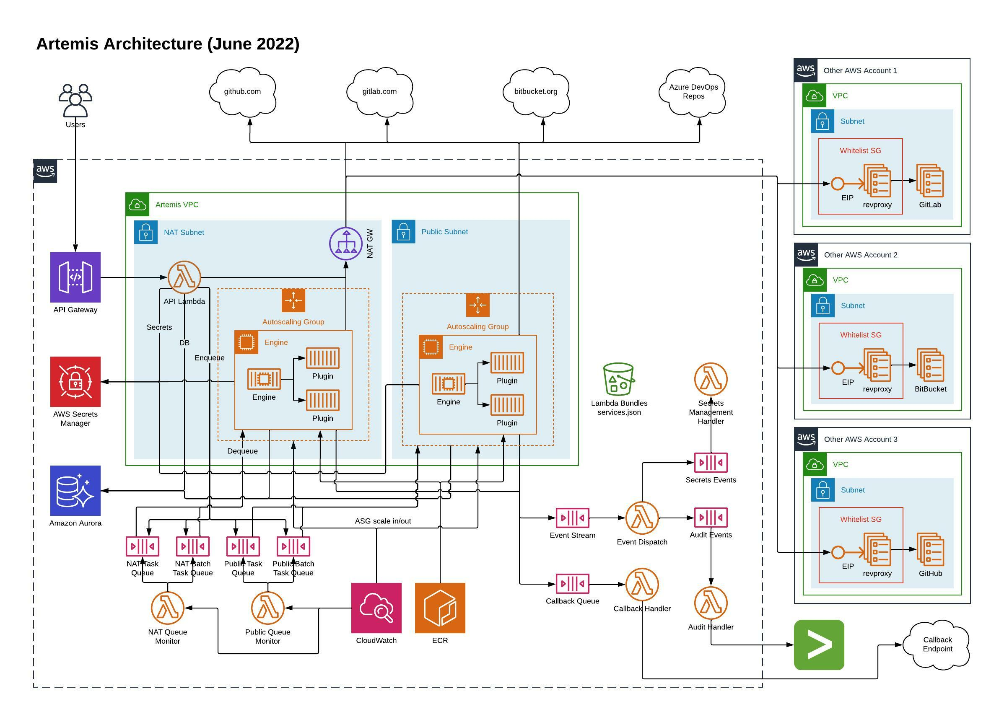
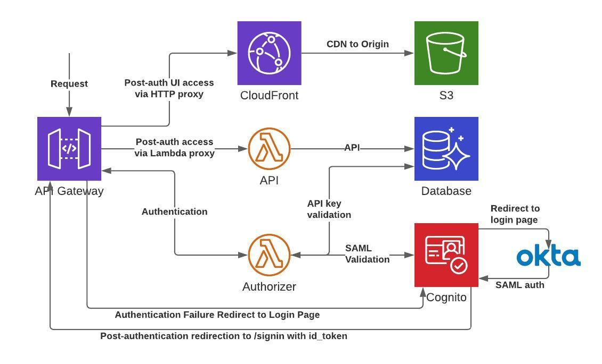
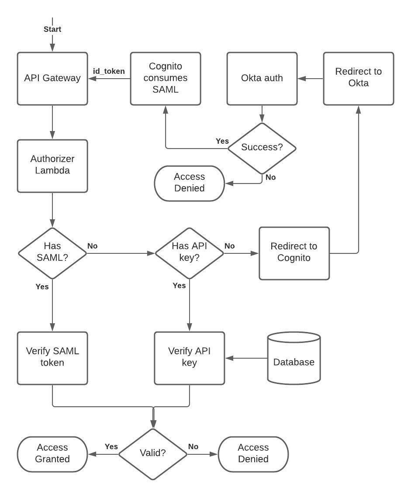

# 🛡️ Artemis: Hunt For Security Issues In Source Code

Artemis is an extensible source code scanning tool developed by the WarnerMedia CSO Application Security team that provides a single interface for running multiple security analysis tools against a source code repository, regardless of the contents of the repository. Artemis can scan repositories in different GitHub, GitLab, Bitbucket, or Azure DevOps organizations from a single, unified platform.

## 📖 Contents

- [🔗 Links](#-links)
- [🗂 Version Overview](#-version-overview)
- [🏠 Local Development](#-local-development)
  - [🚀 Quick Start](#-quick-start)
  - [✅ Prerequisites](#-prerequisites)
    - [🐍 Python](#-python)
    - [⛅ AWS CLI](#-aws-cli)
  - [📃 Coding Conventions](#-coding-conventions)
- [🚢 Initial Deployment](#-initial-deployment)
- [🏛 Architecture](#-architecture)
  - [🔭 Overview](#-overview)
  - [🔬 Detailed Architecture](#-detailed-architecture)
  - [🔐 Authentication](#-authentication)
    - [🔀 Authentication Workflow](#-authentication-workflow)
- [🛠 Maintenance Mode](#-maintenance-mode)
  - [🔧 Enable Maintenance Mode](#-enable-maintenance-mode)
  - [🔧 Disable Maintenance Mode](#-disable-maintenance-mode)
- [License](#license)

## 🗂 Version overview

Artemis is developed and deployed continuously. Major architectural revisions and milestones are snapshotted as releases:

- 1.0.0: Original DynamoDB-based implementation
- 2.0.0: Switched from DynamoDB to PostgreSQL. The API version remained `v1` because the API requests and responses remained the same.

## 🏠 Local Development

### 🚀 Quick Start

If you already have [prerequisites](#-prerequisites) installed, after cloning this project you can get up and running by:

```shell
make docker
python local_env.py > .env
export AWS_PROFILE=<NONPROD_ACCOUNT_PROFILE>
docker-compose -f docker-compose.local.yml up -d
docker exec db_maint artemisdbmanage migrate
```

This will build all of the Docker images, create a file with all of the required environment variables, and stand up a database, two engines, and a [Localstack](https://github.com/localstack/localstack) instance with the required services.

**NOTE**: The Localstack instance does not contain a complete set of services for the full Artemis deployment at this time.

To interface with the local Artemis the [api_runner](https://github.com/warnermedia/artemis/tree/master/utilities/api_runner) utility is used to run the API Lambda code without requiring API Gateway and Lambda environments.

```shell
pipenv shell
ls -d libs/* | xargs pip install -e
ls -d lambdas/api/* | grep -v lambdas/api/spec.yaml | xargs pip install -e
pip install -e utilities/api_runner
api_runner --help
```

### ✅ Prerequisites

The following steps describe how to bootstrap this project for development on a Mac . For Windows or Linux development, comparable steps exist, omitting certain utilities like Homebrew.

1. Install a terminal emulator, like [iTerm](https://iterm2.com/)
2. Install an IDE with support for Python language features or plugins, such as [Visual Studio Code](https://code.visualstudio.com/)
3. Install [Homebrew](https://brew.sh/), a package manager for many of the tools we will be using
4. Install [Python 3](#-python)
5. Install a container management tool, such as [Docker Desktop](https://www.docker.com/products/docker-desktop)
6. Install Git. This can be accomplished by installing Apple XCode from the App Store, via Homebrew, or [directly](https://git-scm.com/download/mac)
7. Clone _this_ GitHub project
8. Install [AWS CLI](https://docs.aws.amazon.com/cli/latest/userguide/install-cliv2.html)
9. Install [Terraform](https://www.terraform.io/) via Homebrew or [directly](https://www.terraform.io/downloads.html)
10. Install [pipenv](https://pypi.org/project/pipenv/) via pip3
    - `pip3 install -g pipenv`

#### 🐍 Python

1. Install pyenv (`brew install pyenv`)
2. Install latest Python 3 (`pyenv install [version]`), latest Python release version [noted here](https://www.python.org/downloads/)
3. Set the Python version to use (`pyenv global [version]`)
4. Ensure Python installers installed and up-to-date (`python -m pip install --upgrade pip setuptools`)

### 📃 Coding Conventions

1. All Python code must be PEP8-compliant, specifically following format generated by the [Black](https://pypi.org/project/black/) auto-formatter, with the difference of line length being 120 instead of Black's default of 88 characters (`--line-length 120`).
    - Many IDEs can be [configured](https://github.com/psf/black/blob/master/docs/editor_integration.md) to automatically run Black when Python files are saved
2. Dockerfiles should lint cleanly using [Hadolint](https://github.com/hadolint/hadolint)

## 🚢 Initial deployment

1. Create a new environment in `terraform/environments`, copying the example and modifing as needed.
2. Create a KMS key with permissions for `AWSServiceRoleForRDS` and set the ARN in `terraform/environments/ENV/main.tf`
3. Create S3 buckets and ECR repositories: `terraform -chdir=terraform/environments/ENV apply -target module.s3 -target module.ecr`
4. Copy `example.mk` to a new `.mk` file that matches the name of the environment created in step 1. The `Makefile` expects `nonprod.mk` to exist by default but can be overridden by setting the `ENV` var to a different value when running make (`make ENV=name`).
5. Build, upload, and stage artifacts: `make build upload move_lambda_bundles deploy_images deploy_scripts`
6. Deploy the rest of the Terraform: `terraform -chdir=terraform/environments/ENV apply`
7. Connect to an engine EC2 instance using System Manager to set up the database:
    - Use the `db_maint` container to connect to the database as an administrator using the value from `db-master-password` in Secrets Manager: `sudo docker exec -it db_maint psql -h DB_CLUSTER_HOST -U artemisadmin -d analyzer`
        - Enable the `ltree` extension: `CREATE EXTENSION IF NOT EXISTS ltree;`
        - Create a normal database user using the values from `db-user` in Secrets Manager: `CREATE USER artemisuser WITH PASSWORD 'PASSWORD';`
        - Give the normal user access to the database: `GRANT ALL PRIVILEGES ON DATABASE analyzer TO artemisuser;`
    - Exit the `db_maint` container and run the database migrations: `sudo docker exec -it db_maint artemisdbmanage migrate`
    - Exit the engine EC2 instance.
8. Modify `services.json` as required for the deployment and upload to the S3 bucket created by Terraform.
9. Redeploy the engine cluster: `make deploy_engine`
10. Follow the [UI initial deployment instructions](../ui/README.md#-initial-deployment).
11. Update `terraform/environments/ENV/main.tf` to set the `ui_origin_url` created during the UI deployment.
12. Deploy the Terraform updates: `terraform -chdir=terraform/environments/ENV apply`
13. Redeploy the API stage via the AWS Console.

## 🏛 Architecture

### 🔭 Overview

Artemis is a cloud-native tool running in AWS. The main components are the API, which is API Gateway+Lambda proxy, the Engine, which runs on EC2 instances in an auto-scaling group configuration, and the database, which is a PostgreSQL-compatible Aurora DB.


### 🔬 Detailed Architecture



### 🔐 Authentication Architecture

Authentication is provided by integrating API Gateway with Cognito. Cognito can be configured to use Okta as its identity provider for user (meaning UI) authentication. API key-based authentication is handled directly in the Authorizer Lambda using key data securely stored in the Artemis database.



#### 🔀 Authentication Workflow



## 🛠 Maintenance Mode

Maintenance mode is used when Artemis needs to be made inaccessible to users in order to perform distruptive maintenance tasks. An example of such a task is a long-running DB migration that will lock tables. In addition to taking the system offline for users, maintenance mode also disables several backend processes that access the database.

Maintenance mode is controlled via Terraform. The control values are stored in variables so that it can be toggled via the CLI without having to modify the Terraform iteself. For this reason, care should be taken to coordinate with the rest of the Artemis team so that other, unrelated Terraform changes are not applied that accidentally disable maintenance mode.

The variables are:

- `maintenance_mode` (boolean) -- Whether Artemis is in maintenance mode.
- `maintenance_mode_message` (string) -- A user-facing informational message. This can be set without enabling maintenance mode to announce upcoming maintenance.
- `maintenance_mode_retry_after` (string) -- ISO 8601-formatted timestamp of the estimated time that maintenance mode will end. This is included in the `retry-after` response header.

Maintenance mode for prod should only be run using the Terraform in the `main` branch to avoid accidentally introducing unrelated changes.

### 🔧 Enable Maintenance Mode

Verify the changes are only related to maintenance mode:

```shell
cd terraform/environments/<ENV>
terraform plan -var maintenance_mode=true -var maintenance_mode_message"<MESSAGE>" -var maintenance_mode_retry_after="<ISO8601>"
```

Apply the changes:

```shell
terraform apply -var maintenance_mode=true -var maintenance_mode_message"<MESSAGE>" -var maintenance_mode_retry_after="<ISO8601>"
```

### 🔧 Disable Maintenance Mode

Verify the changes are only related to maintenance mode:

```shell
cd terraform/environments/<ENV>
terraform plan
```

Apply the changes:

```shell
terraform apply
```

## License

This repository is released under [the MIT license](https://en.wikipedia.org/wiki/MIT_License).  View the [local license file](./LICENSE).
