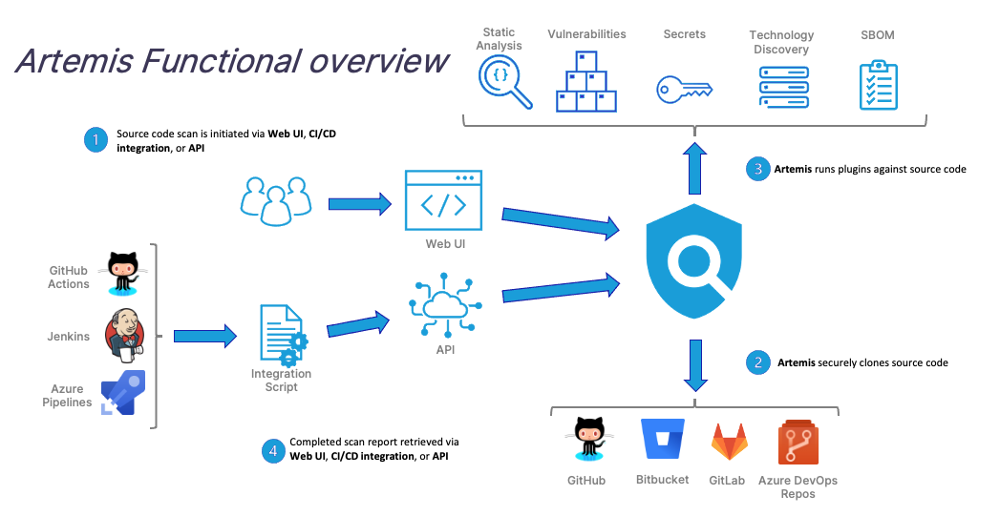

# **Artemis Overview**

Hunt For Security Issues In Source Code

**What is Artemis?** 

Artemis is a unified, cloud-native platform developed by the Warner Bros. Discovery Application Security team for running multiple “zero-configuration-required” security source code scanning tools at scale to “Shift Left” security. Ad-hoc scans can be run via the user-interface or the API can be used to integrate via CI to gate builds based on certain criteria such as vulnerability severity or secrets detected. Artemis runs a collection of Static Analysis, Dependency Vulnerability (Software Composition Analysis), Secrets Disclosure and Technology Discovery tools against the source code and provides a normalized output of the findings. 

 **Why Use Artemis?**

**Simplicity:** Abstracts away tool complexity while providing unified, normalized, de-duplicated results  
**Shift-Left:** Easy to integrate into early SDLC phases  
**Scalability:** Works across the enterprise with support for both cloud and on-premise versions of GitHub, GitLab, Bitbucket and Azure DevOps  
**Extensibility:** Custom coverage to meet business use-cases
    

**[Main](../README.md)**

