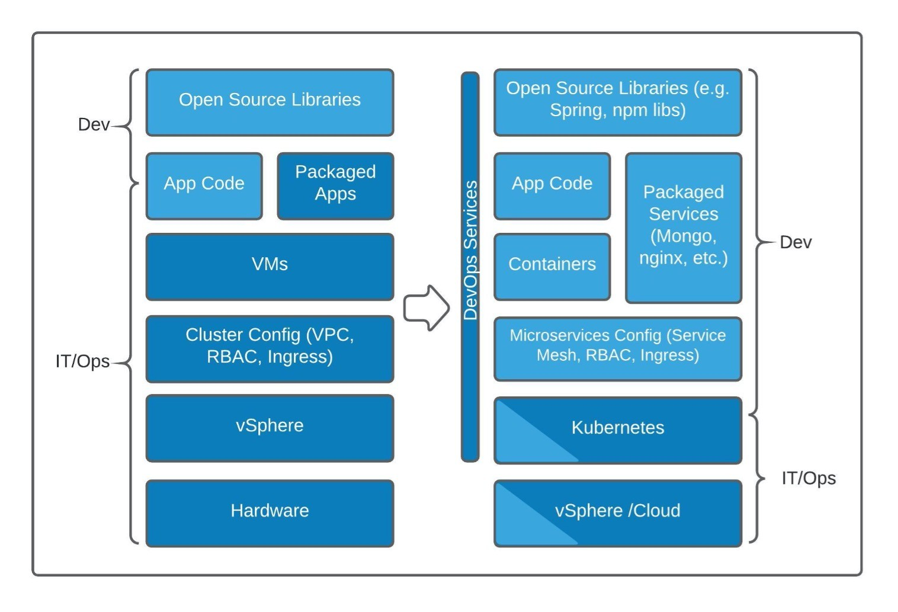
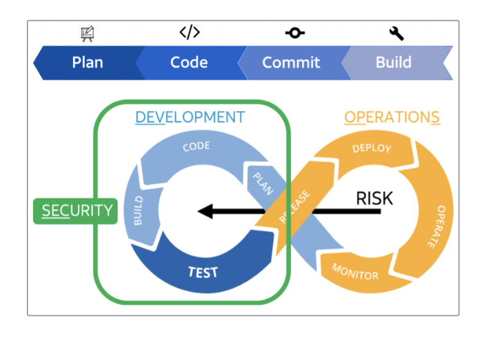
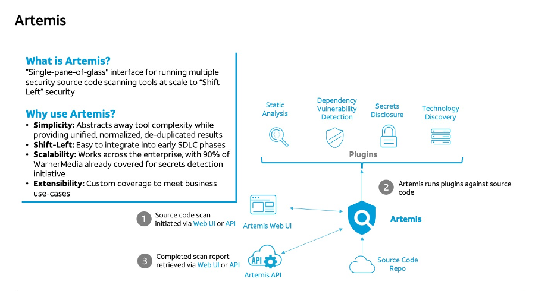

### Contents

- [Why Shift-Left? Why Artemis?](#why-shift-left-why-artemis)
    - [Summary](#summary)
    - [What is Shift Left Security?](#what-is-shift-left-security)
    - [Development Trends](#development-trends)
    - [Security Challenges](#security-challenges)
    - [How do we address these challenges?](#how-do-we-address-these-challenges)
    - [How do I implement a Shift-Left strategy?](#how-do-i-implement-a-shift-left-strategy)
    - [Artemis addresses the following Shift-Left challenges:](#artemis-addresses-the-following-shift-left-challenges)
    - [How can Artemis be incorporated into a Shift-Left strategy?](#how-can-artemis-be-incorporated-into-a-shift-left-strategy)
  - [Conclusion](#conclusion)

# Why Shift-Left? Why Artemis?
### Summary

Implementing a "Shift-Left" strategy can be challenging. From picking the right tools to integrating them into your SDLC, all while minimizing maintenance and churn... there's got to be an easier way!
Artemis provides a unified platform for running multiple source code scanning tools at scale and integrating into existing SDLC workflows, such as code commit and CI.

### What is Shift Left Security?

Shift Left, as applied to a software methodology means to move a person, process or technology earlier in the development lifecycle to increase efficiency or gain quicker results. Within security, this means bringing security considerations into the early development phases of a product lifecycle rather than later, after it has already entered service or production.

### Development Trends

There are many advantages that have emerged from recent trends in software development, such as Agile practices, Cloud transformation, software composition, “infrastructure as code”, continuous integration and deployment, containerization and microservices, including:

1. Rapid acceleration in application development and delivery,
1. Software that is increasingly composed of third-party components instead of authored first-hand, and
1. A shift in developer responsibilities, where “DevOps” engineers now own parts of the application execution stack (for example, runtime and services, configuration, and deployment) that was traditionally managed by a separate operations team.

However, these advantages in terms of speed, scalability, and resiliency have come with new security challenges.

> Software is taking over the stack – Snyk Ltd.

### Security Challenges

What are some of these new security challenges?

1. Security must keep pace with development without slowing the pipeline or causing unplanned disruptions,
1. Heterogeneous software supply chains must be secured, and
1. Security controls must be enforced without a separate IT/operations team acting as security “gatekeepers”.

In addition to this, the likelihood and consequences of security events are increasing, as shown by recent high-profile incidents at SolarWinds and Colonial Pipeline.
Unfortunately, many traditional security controls, such as late-stage security assessments/penetration tests or static host scans are insufficient by themselves because they do not provide information to developers while they are coding and often lead to “technical debt”, delays in mitigating serious security issues, and unacceptable delivery delays.

    Traditional security approaches assess security at TEST/RELEASE & OPERATE/MONITOR phases.
    “Shift-left” pushes assessment back into earlier phases.

### How do we address these challenges?

Organizations must adopt the same agile methodologies for security as they do for development: it must be early, iterative, scalable, and feedback driven. You may have heard this referred to as a “Shift-Left” security methodology, because the basic premise is that security shouldn’t be applied late in or even after the development process: it should be embedded in each phase of the Software Development Lifecycle (SDLC), from initial planning, architecture, and design through release or deployment. Shifting security earlier into the process has several advantages:

- Remediations are generally cheaper and less disruptive to apply (both for teams and customers),
- Development teams can grow their security knowledge organically by receiving security feedback related to their code changes (“I made this change and it resulted in these security results”), and
Issues can be remediated before breaches occur that can result in reputational damage, financial loss, operational disruption, or legal ramifications. (See: IBM System Science Institute Relative Cost of Fixing Defects. Retrieved Sep 4, 2020 from https://www.researchgate.net/figure/IBM-System-Science-Institute-Relative-Cost-of-Fixing-Defects_fig1_255965523).

> Developers are 70% more likely to fix issues in the PR phase - Sonatype Marketing Materials

### How do I implement a Shift-Left strategy?

This is a large subject and could easily be the topic for many articles, but for the purpose of this discussion we will focus on how to get your foot in the door if you are starting from square-one. Alternately, we will help you simplify if you have already headed down the path of trying to integrate a bunch of disparate tools and processes. From a SDLC standpoint, we will focus on the code, commit, and build phases that makeup a software developer's daily routine (outside meetings and caffeine of course). In these phases the application is still in source code form, so we will be performing static code analysis. We differentiate this from runtime analysis, which occurs later in the SDLC when code has been compiled and (potentially) deployed and may be working in orchestration with other components (making a unified strategy more difficult).

Because we are scanning source code, the tools at this phase are generally (programming) language- and framework-specific and there are many to choose from, each with its own strengths and weaknesses, including commercial-off-the-shelf (COTS) products, Open Source packages, and in-house developed tools to meet specific business requirements. The challenges of implementing a successful "Shift-left" strategy at this phase include:

1. What tools do you chose to best suit your environment, such as your source code technology stack? What if this stack changes?
1. How do you license these tools so that you can scan this source code as frequently as possible to detect new vulnerabilities?
1. How do you incorporate these tools into SDLC processes (such as code reviews and CI builds)?
1. How do you engage developers with their usage?
1. Finally, how do you mitigate the impact to development velocity when tools need to be added, removed, or changed? 
    
A small change in the output format of a single tool, let alone having to replace a tool entirely can have tremendous downstream impact on associated integrations and automation.

Artemis was developed to address these challenges.  Artemis is a unified, cloud-native platform for running multiple “zero-configuration-required” security source code scanning tools at scale. Artemis is not a single security scanner, it is an abstraction layer that employs scalable scan engines to run a variety of scanning tools (as plugins) against source code to detect dependency vulnerabilities, static analysis, secrets discovery, and technology inventory (languages and container images). Scans can be initiated, and results retrieved using either a RESTful API or a web user interface. Artemis is already able to scan source code both in the cloud and on-premises in many Version Control Systems (VCS) including GitHub Enterprise, GitLab, Bitbucket, CodeCloud. 

### Artemis addresses the following Shift-Left challenges:

* **Complexity:** Artemis abstracts away individual tool complexity (no individual tool configuration is required) and provides results from all tools in a unified, normalized, and de-duplicated format  
* **Shift-Left:** Artemis is easy to integrate into early SDLC phases such as code commit, build, and deploy    
* **Scalability:** Artemis works across the enterprise supporting major Git based Version Control Systems.  
* **Extensibility:** Artemis' plugin architecture allows for rapidly adding coverage for new languages and frameworks and to add custom coverage to meet business use-cases

### How can Artemis be incorporated into a Shift-Left strategy?

During the code phase, an individual developer can use the Artemis web UI to run a manual scan, view results, and perform other tasks such as allow-listing findings and creating API keys. During the commit phase, Artemis is being integrated with VCS code commits (starting with GitHub Enterprise) so that changes in each commit can be scanned for vulnerabilities and secrets and used to gate code merges (providing visibility to individual developers and team). During the build or deployment phases, Artemis can be integrated into various CI/CD pipelines so that builds/deployments can be gated based on security findings (providing visibility to individual developers and team).

## Conclusion

In conclusion, technologies have changed rapidly over the past decade (Cloud, containerization, etc.), accompanied by dramatic shifts in development processes and methodologies (Agile, DevOps, etc.). To adapt to new challenges created by these changes, security must adopt a more responsive "Shift-Left" strategy. This is easier said than done - it takes not only the right tools but also a comprehensive approach for combining these tools, integrating them into SDLC, and making the results accessible so that they can be remediated and serve as a continuous learning and improvement mechanism. Artemis was designed to take the hard-work out of this security "Shift-Left" so teams can focus on other things.

[Main](../README.md)