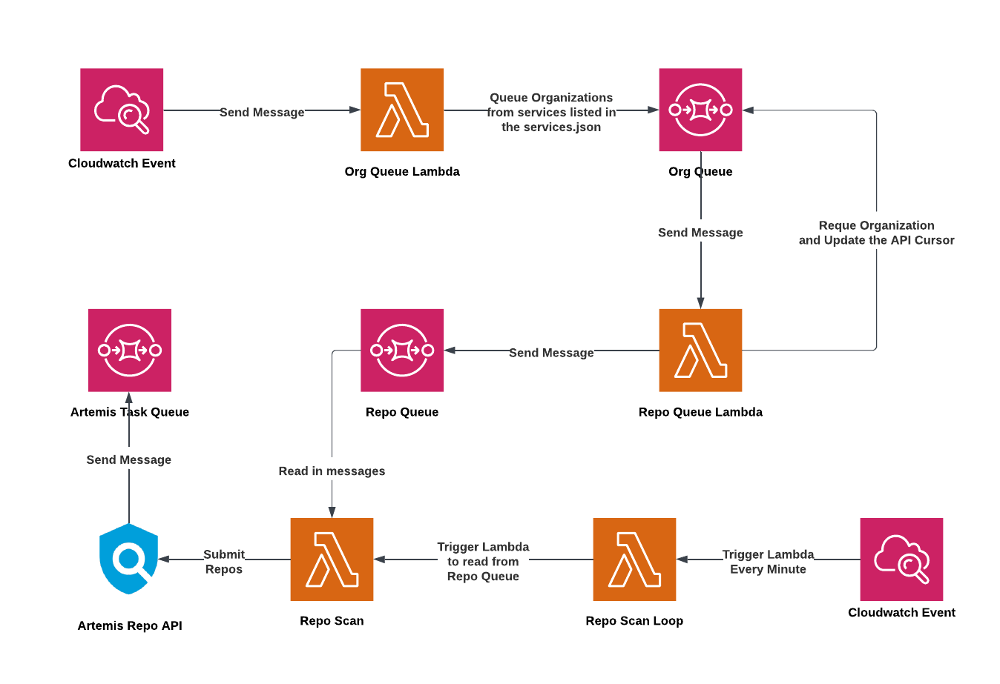

# Heimdall

## Overview

Artemis Scan Orchestrator

> Heimdall is attested as possessing foreknowledge, keen eyesight and hearing, and keeps watch for invaders and the onset of Ragnarök while drinking fine mead in his dwelling Himinbjörg, located where the burning rainbow bridge Bifröst meets the sky. [Wikipedia](https://en.wikipedia.org/wiki/Heimdallr)

Heimdall is a tool for initiating Artemis scans across a large set of services, repositories, and branches at once. At its broadest, it can be configured to initate a full Artemis scan of every branch of every repository in every service that Artemis supports on a recurring schedule. Multiple different scans can be configured to run on different schedules, each with a different scan configuration, such as limiting the set of plugins run to target just secrets detection or just scanning a particualar service and organization or just scanning the primary branch of every repository. Additionally, Heimdall has a REST API for initiating scans in an ad-hoc manner. Artemis scans initiated by Heimdall receive lower priority by Artemis and are always processed after any scans initiated via the UI or CI integrations.

## Supported Version Control Systems

Heimdall can schedule scans in the following Version control systems:

- [Azure DevOps](https://azure.microsoft.com/en-us/products/devops)
- [Bitbucket Cloud v2](https://bitbucket.org/product)
- [Bitbucket Enterprise Server v1](https://www.atlassian.com/software/bitbucket/enterprise)
- [GitHub](https://github.com/)
- [GitLab](https://about.gitlab.com/)

## Lambdas

- [Repo Scan](https://github.com/WarnerMedia/artemis/tree/main/orchestrator/lambdas/repo_scan)
- [Repo Scan Loop](https://github.com/WarnerMedia/artemis/tree/main/orchestrator/lambdas/repo_scan_loop)
- [Repo-Queue Lambda](https://github.com/WarnerMedia/artemis/tree/main/orchestrator/lambdas/repo_queue)
- [Org-Queue Lambda](https://github.com/WarnerMedia/artemis/tree/main/orchestrator/lambdas/org_queue)

### Standard Lambda Configurations

These are Environment Variables that are used in all Heimdall Lambdas

| Variable                            | Description                                                                                                                             |
| ----------------------------------- | --------------------------------------------------------------------------------------------------------------------------------------- |
| `APPLICATION`                       | Name of the application                                                                                                                 |
| `ARTEMIS_API`                       | URL of the Artemis API                                                                                                                  |
| `ARTEMIS_REVPROXY_DOMAIN_SUBSTRING` | This substring is used to identify version control systems that are self-hosted                                                         |
| `ARTEMIS_REVPROXY_SECRET`           | Secret manager secret containing Authentication string                                                                                  |
| `ARTEMIS_REVPROXY_SECRET_REGION`    | The AWS region where the `ARTEMIS_REVPROXY_SECRET` is stored                                                                            |
| `ARTEMIS_S3_BUCKET`                 | The s3 bucket location for Artemis                                                                                                      |
| `HEIMDALL_GITHUB_APP_ID`            | The APP ID for the Github App used for scanning repositories                                                                            |
| `HEIMDALL_GITHUB_PRIVATE_KEY`       | This variable stores the private key for the GitHub App. The private Key and the GitHub App are used to make requests to the GitHub API |
| `HEIMDALL_LOG_LEVEL`                | logging level                                                                                                                           |
| `REGION`                            | The AWS region where the lambda is deployed                                                                                             |

## Queues

- [Repo SQS Queue](https://github.com/WarnerMedia/artemis/blob/c529b00c667da5d3c83678f3e279f7a8c41c1b45/orchestrator/terraform/modules/heimdall/messaging.tf#L34-L47)
- [ORG SQS Queue](https://github.com/WarnerMedia/artemis/blob/c529b00c667da5d3c83678f3e279f7a8c41c1b45/orchestrator/terraform/modules/heimdall/messaging.tf#L5-L19)

#### `ORG SQS Queue` Message Format:

The messages sent to the `ORG SQS Queue` are in this format:

```jsonc
{
  "service": "github",                                                  // Valid inputs are github, bitbucket, gitlab, ado,
  "org": "Warnermedia",                                                 // Name of the Organization to Process
  "page": {
    "cursor": "15",                                                     // Cursor used in paginated API requests to retrieve a batch of repositories
    "branch_cursor": "25"                                               // Cursor used in paginated API requests to retrieve a batch of branches in a repo
  },
  "batch_id": "BATCH123",                                               // ID for the triggered batch scan
  "plugins": ["technology_discovery", ...],                             // List of Plugins to run
  "default_branch_only": true,                                          // True if only the default branch should be scanned. False if otherwise
  "redundant_scan_query": "plugin__contains=gitsecrets",                // Query used by the artemis API to check if an existing scan exists
  "repo": ""                                                            // When this variable is specified, the repo-queue-lambda will only process this repo and not the entire organization
}
```

#### `REPO SQS Queue` Message Format:

The messages sent to the `REPO SQS Queue` are in this format:

```jsonc
{
  "service": "github", // Available options: ado, github, bitbucket, gitlab
  "org": "Warnermedia", // Name of the organization to scan
  "repo": "artemis", // Name of the repo to scan
  "branch": "main", // Name of the branch to scan
  "plugins": ["trufflehog"], // List of plugins to run during the Artemis Scan
  "batch_id": "BATCH123" // Batch ID for the triggered scan. Helps to identify scans that were triggered at the same time
}
```

## Local Development

### Running Tests

To run unit-tests:

```sh
make unit-test ENV=example
```

## Deployment

### 🚢 Initial Deployment

1. Create a new environment in `terraform/environments`, copying the example and modifing as needed.
2. Create S3 buckets and ECR repositories: `terraform -chdir=terraform/environments/ENV apply -target module.heimdall.aws_s3_bucket.heimdall_files`
3. Copy `example.mk` to a new `.mk` file that matches the name of the environment created in step 1. The `Makefile` expects `nonprod.mk` to exist by default but can be overridden by setting the `ENV` var to a different value when running make (`make ENV=name`).
4. Build, upload, and stage artifacts: `make upload_lambdas`
5. Deploy the rest of the Terraform: `terraform -chdir=terraform/environments/ENV apply`
6. Create an Artemis API key and store it in Secrets Manager

### Lambda Deployments

After the initial deployments are complete, run these commands in the [orchestrator directory](../orchestrator/) to deploy the Heimdall Lambdas:

```sh
make build              # Build all lambdas
make upload_lambdas     # Upload lambdas to s3
make deploy_lambdas     # Deploys all lambda
make clean              # Cleans up the build directories
```

Lambdas and Layers can be deployed independently through other commands. To view all available commands run:

```sh
make help
```

### Terraform Deployments

After the initial deployments are complete, updates to the terraform configurations can be deployed using these commands:

```sh
cd /terraform/environments/<insert_environment_name>
terraform apply
```

## Architecture


